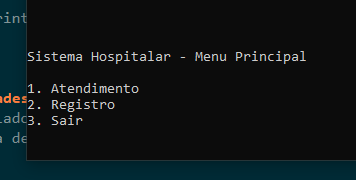
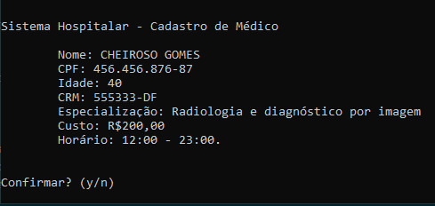
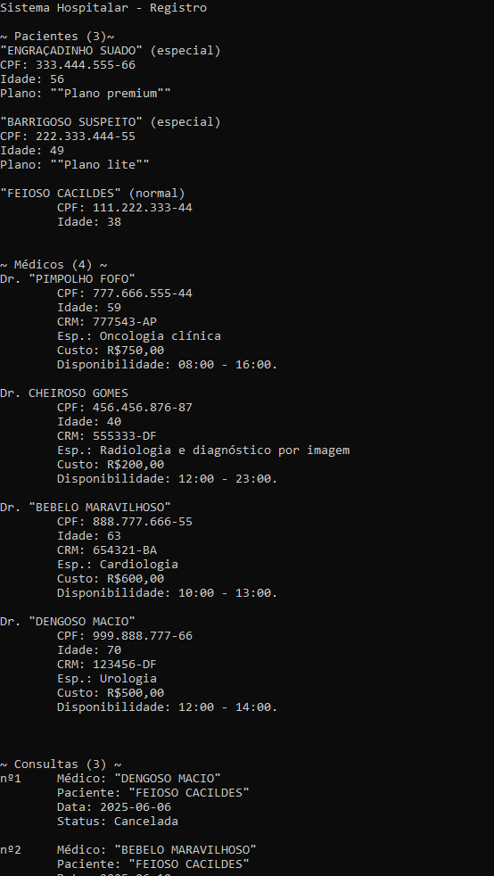

## Dados do Aluno

- **Nome completo:** Pietro Ritchele de Oliveira Rodrigues
- **Matrícula:** 242015334

## Instruções para Compilação e Execução

1. **Compilação:**  
   Clique duas vezes no arquivo compilar.bat, e espere o programa iniciar.

2. **Execução:**  
   Caso já tenha compilado pela primeira vez, basta usar o arquivo rodar.bat.

3. **Estrutura de Pastas:**  
   src: arquivos fonte
   bin: arquivos binários
   data.csv: manuseio de dados permanentes

Java 21

## Vídeo de Demonstração

https://drive.google.com/file/d/1c4rZsNPunAx3UAd5T2uSmcBSADip7w9i/view?usp=sharing

## Prints da Execução

1. Menu Principal:  
   

2. Cadastro de Médico:  
   

3. Relatório de ?:  
   

## Observações (Extras ou Dificuldades)
Me atentei em desenvolver um gerenciador de compilação em batch script, que ficou bem chique. Tive dificuldade em implementar um sistema de permanência de dados, o programa consegue ler de data.csv mas não consegue escrever nele. Utilizei bastante a classe Optional para lidar com valores possivelmente nulos na hora de desenhar a interface. Não consegui capturar o som do microfone quando fui gravar o vídeo!

## Contato
ritchelepietro@gmail.com